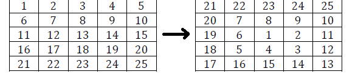

# Spiral Array puzzle

This script solves the problem of printing a 2-D array in a clockwise expanding spiral from its center. 

## Introduction

Printing a 2-D array in a clockwise expanding spiral from its center can be a useful operation in various applications such as image processing, matrix manipulation, and more. This script provides a solution to this problem.



## Solution

The script defines a function `generate_spiral_matrix(matrix_size)` that takes `matrix_size` as input and prints an array of that size with expanding spiral order. It iterates through the matrix, printing elements as it moves in a spiral pattern from the center of the array.

## Example Usage
`generate_spiral_matrix(3)`
```
[[5, 6, 7],
[4, 1, 8],
[3, 2, 9]]
```